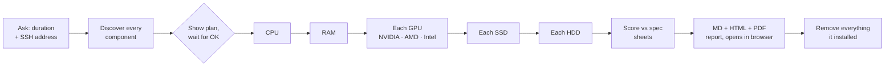

<div align="center">

# Proxmox Hardware Stress Test

**Find out if every part of your Proxmox server runs as well as it should.**<br>
A Claude skill that discovers all your hardware, stress-tests each part over SSH (CPU, RAM, NVIDIA / AMD / Intel GPUs including integrated graphics, every SSD and HDD), and hands you a scored, plain-English report.

[](CHANGELOG.md)
[](#requirements)
[](skill/proxmox-hardware-stress-test/SKILL.md)
[](LICENSE)
[](https://github.com/vanticstudio/proxmox-test/actions/workflows/ci.yml)

[Quick start](#want-to-use-this-the-simple-way) · [What you get](#what-you-get) · [Supported GPUs](#supported-gpus) · [Install options](#other-ways-to-install) · [Safety](#safety-first) · [Docs](docs/)

</div>

---

## Want to use this the simple way?

Copy the prompt below, paste it into your AI agent (Claude Code or any agent that can run commands on your computer), and swap in your Proxmox server's address. That's it: the agent fetches the skill from this repository and walks you through the rest.

```text
Use the Proxmox hardware stress-test skill from https://github.com/vanticstudio/proxmox-test/tree/main/skill/proxmox-hardware-stress-test and install that folder into ~/.claude/skills/proxmox-hardware-stress-test (if you can't install skills, read its SKILL.md and follow it step by step with the scripts in that folder). Then run it against my Proxmox server at root@YOUR-PROXMOX-IP. Ask me how long to test each part before you start.
```

> [!TIP]
> Replace `YOUR-PROXMOX-IP` with your server's IP or hostname. The skill logs in with an SSH key, so set one up first if you haven't:
> `ssh-keygen -t ed25519` (only if you have no key), then `ssh-copy-id root@YOUR-PROXMOX-IP`.

---

## What you get

You choose **30 seconds, 1, 5 or 10 minutes** per part. The skill then:



| | |
|---|---|
| **Finds everything** | Board and BIOS, every CPU socket, every RAM slot (empty ones too), every GPU (NVIDIA, AMD or Intel, including integrated ones), every NVMe / SATA / SAS drive (including behind HBAs and RAID cards), NICs and sensors. A mini PC and a dual-socket server get the same report. |
| **Plans before it touches anything** | Shows every part, how it will be tested (or why it's skipped), what it would install and the total time. Nothing runs until you say yes. |
| **Tests one part at a time** | So every temperature and power reading belongs to that part. Power, temperature, clocks and throttling are logged every second. |
| **Scores, not just numbers** | Each result is shown as **% of expected** against the spec sheet or a well-known published benchmark, with a plain-English verdict per part. |
| **Three reports** | Markdown, a designed HTML page (light/dark, works offline) that **opens in your browser automatically**, and a PDF. |
| **Leaves no trace** | Copies the logs to your computer, then removes exactly the packages it installed and its working folder. |

### Example report summary

> Illustrative numbers for a generic box, to show the format. Not measurements from a real machine.

| Part | Key result | % of expected | Peak temp | Peak power | Verdict |
|---|---|:---:|:---:|:---:|---|
| **CPU** | 7-Zip 100,000 MIPS | ~98% | 80 °C | 150 W | ✅ Running optimally |
| **RAM** | 50 GB/s, 16 GB verified, 0 errors | ~95% | 75 °C | 120 W | ✅ Running optimally |
| **GPU 1** (discrete) | FP32 10.0 TFLOPS | ~97% | 70 °C | 200 W | ✅ Running optimally |
| **GPU 2** (integrated) | FP32 1.0 TFLOPS | ~95% | 65 °C | 15 W (shared with CPU) | ✅ Running optimally |
| **SSD 1** | 3,000 / 2,500 MB/s read / write | ~99% | 50 °C | n/a | ✅ Running optimally |
| **HDD 1** | 200 / 200 MB/s read / write | ~98% | 40 °C | n/a | ✅ Running optimally |

More GPUs or disks just add rows. Parts your box doesn't have show as "Not present". See [docs/report-format.md](docs/report-format.md) for the full report layout.

---

## Supported GPUs

Every GPU in the box is found and tested in turn: discrete cards **and** integrated graphics, from any of the three vendors. Each gets the same full suite: a stress phase at full load for the duration you chose, benchmark scores ("% of expected"), per-second telemetry and its own section in the report.

| GPU type | Examples | How it's tested | Telemetry |
|---|---|---|---|
| **NVIDIA** discrete | GeForce GTX / RTX, Quadro, RTX A-series, Tesla | `hashcat` + `clpeak` over the NVIDIA driver's OpenCL | `nvidia-smi`: power, temps, clocks, load, fan, VRAM, throttle reasons |
| **AMD** discrete | Radeon RX 500 / 5000 / 6000 / 7000, Radeon Pro | Same tests over Mesa's OpenCL (rusticl) | `amdgpu` sensors: power, edge / junction / memory temps, clocks, load, fan, VRAM |
| **Intel Arc** discrete | Arc A310 / A380 / A580 / A750 / A770, B580 | Same tests over Intel's compute runtime or Mesa rusticl | `i915` / `xe` sensors: power, temperature, clocks, throttle reasons, load |
| **Intel integrated** | UHD 630 / 730 / 770, Iris Xe, N100-class mini PCs | Same tests | Clocks, load and temperature; power from the CPU's graphics share (marked "shared with CPU") |
| **AMD integrated** (APUs) | Ryzen with Radeon 680M / 780M / Vega graphics | Same tests | Clocks, load and temperature; power from the shared APU package (marked "shared with CPU") |

Good to know:

- **Integrated GPUs share power and memory with the CPU.** Their power is reported as "shared with CPU", and their memory bandwidth is judged against the system RAM's speed rather than a VRAM spec.
- **Software comes from your own apt repos.** For AMD and Intel the skill installs a userland OpenCL runtime (`mesa-opencl-icd` and, where packaged, `intel-opencl-icd`) and removes it afterwards. It first simulates the install and skips it if apt would pull in a kernel, firmware or DKMS package or upgrade something already on the host; that GPU is then marked "limited" (telemetry only) with the reason in the plan. Newer GPUs work best on Proxmox VE 9; on PVE 8 an AMD card needs `bookworm-backports`.
- **Not tested:** GPUs passed through to a VM (bound to `vfio-pci`), and very old GPUs without a modern OpenCL path (pre-GCN AMD on the `radeon` driver, Intel graphics older than Gen8). The plan lists these with the reason.

> [!NOTE]
> NVIDIA support has been run on real hardware. **AMD and Intel support is new in 1.1.0 and has so far been verified against simulated hardware only.** If you run it on an AMD or Intel GPU, please [share your results](https://github.com/vanticstudio/proxmox-test/issues/new/choose) using the hardware report template, good or bad, so it can be confirmed and tuned.

---

## Safety first

Your Proxmox host holds your VMs and data, so the skill is deliberately careful:

- **Never writes to a raw disk.** Write tests use one temporary, size-capped file on a mounted filesystem, which is always deleted.
- **Read-only for pool members.** ZFS, Ceph, mdraid, LVM-only and hardware-RAID disks are only read, with `fio --readonly`.
- **No drivers, no tuning.** Never installs or removes GPU drivers, kernel modules, DKMS packages or firmware (AMD/Intel get a userland OpenCL runtime only), and never changes BIOS, power limits, CPU governors, fans, GPU clocks or kernel settings.
- **Hands off your guests.** Never starts or stops VMs or containers, and skips GPUs and disks passed through to a VM.
- **Asks first, cleans up after.** Nothing installs or runs before you approve the plan; only the packages it added are removed.

Full details and how to report a safety issue: [SECURITY.md](SECURITY.md).

---

## Other ways to install

| Option | Best for | How |
|---|---|---|
| **One-click `.skill`** | Claude apps with skill upload | Download [`dist/proxmox-hardware-stress-test.skill`](dist/) and upload it in your Claude app's skill settings |
| **Zip** | Claude Code | Unzip [`dist/proxmox-hardware-stress-test.zip`](dist/) into `~/.claude/skills/` |
| **Terminal** | Claude Code, one command | See below |

```bash
git clone --depth 1 https://github.com/vanticstudio/proxmox-test.git /tmp/pve-stress \
  && mkdir -p ~/.claude/skills \
  && cp -R /tmp/pve-stress/skill/proxmox-hardware-stress-test ~/.claude/skills/ \
  && rm -rf /tmp/pve-stress
```

Then just ask, for example: *"Run a 5-minute burn-in on my Proxmox box at 192.0.2.10 and check the CPU temps and NVMe speed."*

Step-by-step guide, checking the install, and uninstalling: [docs/installation.md](docs/installation.md).

> [!NOTE]
> **The `.skill`, the `.zip` and the [`skill/proxmox-hardware-stress-test/`](skill/proxmox-hardware-stress-test/) folder contain exactly the same files.** The `.skill` is just a zip with a different extension so Claude apps can install it in one click. Use the folder or the `.zip` to read, audit or extend the skill, and rebuild with `tools/build.sh`. Verify downloads with [`dist/SHA256SUMS`](dist/SHA256SUMS). More: [docs/packages-explained.md](docs/packages-explained.md).

---

## Requirements

<table>
<tr><th>On your computer</th><th>On the Proxmox host</th></tr>
<tr valign="top"><td>

- [Claude Code](https://claude.com/claude-code) or another agent that can run shell commands
- `ssh` with key login to the host (Tailscale SSH works too)
- `python3` (standard library only)
- Optional: Chrome, Chromium, Edge or Brave to make the PDF
- macOS, Linux or WSL

</td><td>

- Proxmox VE 8 or 9 (Debian 12 / 13), Intel or AMD
- Root SSH, or a user with passwordless `sudo`
- apt access to install the test tools
- GPU: NVIDIA, AMD and Intel, discrete and integrated (optional)
- For full disk scores: ~2x the test file free (16 GB SSD, 8 GB HDD); otherwise disks are tested read-only

</td></tr>
</table>

---

<details>
<summary><b>What runs on the host</b></summary>
<br>

Installed from the host's own apt repos and removed afterwards:

| Part | Tools |
|---|---|
| CPU | `stress-ng`, `sysbench`, 7-Zip |
| RAM | bundled STREAM bandwidth and latency tests, `stress-ng --verify`, `memtester` |
| GPU (NVIDIA, AMD, Intel) | `hashcat` and `clpeak` over OpenCL; for AMD / Intel the userland OpenCL runtime too (Mesa rusticl, Intel compute-runtime), never drivers |
| Disks | `fio`, `smartctl`, `nvme-cli` |

How every step works: [docs/how-it-works.md](docs/how-it-works.md).

</details>

<details>
<summary><b>Repository layout</b></summary>
<br>

```
proxmox-test/
├── README.md                  you are here
├── skill/
│   └── proxmox-hardware-stress-test/   the skill itself (source of truth)
│       ├── SKILL.md           the workflow the agent follows
│       ├── assets/            HTML report template
│       ├── references/        report structure, reference values, safety notes
│       └── scripts/           scripts run on the host (+ one run locally)
├── dist/                      ready-to-install .skill and .zip + SHA256SUMS
├── docs/                      installation, packages, how it works, report format, developing
├── tools/build.sh             rebuilds dist/ from skill/
├── CHANGELOG.md · CONTRIBUTING.md · SECURITY.md · LICENSE
└── .github/                   issue templates, PR template, CI
```

</details>

<details>
<summary><b>Contributing</b></summary>
<br>

Hardware results, bug reports and improvements are welcome, especially from hardware the skill hasn't seen yet. Start with [CONTRIBUTING.md](CONTRIBUTING.md) and, for code changes, [docs/developing.md](docs/developing.md). Please never include personal or host data (hostnames, IPs, serial numbers) in issues or pull requests.

</details>

<details>
<summary><b>Disclaimer</b></summary>
<br>

Stress testing deliberately runs hardware at full load. On healthy, well-cooled hardware that is safe and is exactly what burn-in tests are for, but it can expose an existing fault (a failing disk, an unstable RAM overclock, poor cooling) at that moment. Keep your backups current and don't run it on a production host during working hours. **You use it at your own risk**; the authors accept no liability for data loss, downtime or hardware damage. The "expected" values are approximate references, not guarantees.

This is an independent community project, **not affiliated with, endorsed by or sponsored by Proxmox Server Solutions GmbH or Anthropic**. Proxmox and Claude are trademarks of their respective owners.

</details>

<div align="center">
<br>

[MIT License](LICENSE) · [Changelog](CHANGELOG.md) · [Security](SECURITY.md) · [Report an issue](https://github.com/vanticstudio/proxmox-test/issues/new/choose)

</div>
